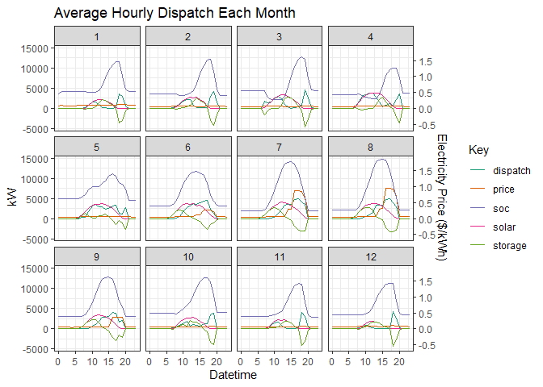
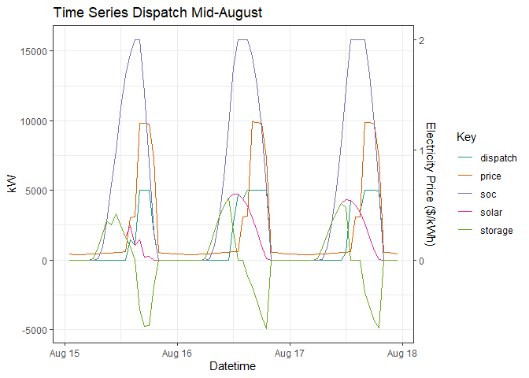
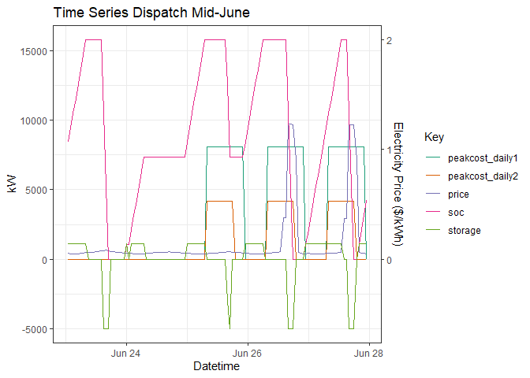

Grid Edge Optimization
================
Brock Taute
4/30/2020

# Background

This repo contains libraries to optimize an energy storage system’s
economic dispatch in grid “edge” scenarios. It includes a convex problem
formulation and an interface to the CVXR package. It’s intended for
prototyping and modeling different storage solutions and so emphasizes
customizability over speed. It includes functions to set up and simulate
a testing environment where new information is released periodically,
such as with the Day Ahead pricing market. It also enables the analysis
of sophisticated utility tariffs, including multiple different demand
charge rate structures based on seasons, day of the week, and monthly or
daily billing periods. Project configurations can range from standalone
solar or storage projects to projects with solar, storage, and a
consumer load all on the same meter.

# Examples:

## 1\. Remote Net Metering of a Solar + Storage Project

A remote net metering project fully utilizing the New York Value Stack
Tariff would have the goal of shifting solar production to take
advantage of the variable Day Ahead electricity pricing. Each day at
11AM, the following day’s pricing becomes available, which will give the
economic dispatch engine an opportunity to update the optimal dispatch
for the next 37 hours. For this example, a 5MW canopy solar system and a
5MW/15MWh energy storage system were assumed to be connected with a grid
injection limit of 5MW. It was also assumed that the storage system
could only charge when offsetting solar production (it couldn’t charge
from the grid.)

Using Day Ahead electricity pricing and solar production from 2018, a
full year’s dispatch can be simulated at hourly intervals.

``` r
# Define the system

charge_efficiency <- .95
discharge_efficiency <- .95
storage_power <- 5000 # kW
storage_energy <- 15000 / discharge_efficiency # Nominal kWh
soc_start <- storage_energy
poi_limit <- 5000

# Defaults of function are for a NYSERDA, 1-Year simulation where
# Day Ahead pricing is released daily at 11AM
fs <- get_forecast_sequences()

rs <- simulate_remote_net_meter(fs$forecast_sequence, fs$forecast_lengths,
                             data$price, data$solar, storage_power,
                             storage_energy, poi_limit, charge_efficiency,
                             discharge_efficiency, soc_start)

df <- mutate(data,
             storage = rs$storage,
             soc = rs$soc,
             dispatch = solar - storage,
             value = price * dispatch)
```

    ## Predicted annual return:  $1922868 
    ##  Number of Storage Cycles per Year:  206.7

<!-- -->

<!-- -->

Looking at the dispatch plots, it is evident that the New York Value
Stack Tariff should have the intended consequence of incentivizing solar
production to be shifted toward the evenings.

## Example 2. Standalone Storage System with Multiple Demand Tariffs

For any system that consumes electricity from the grid, a utility bill
must be considered in the dispatch algorithm. For systems greater than a
MW in size, these tariffs can often be quite complex, with several
different time-of-use structures. To demonstrate how a tariff like this
might be incoporated in the optimization, a tariff structure from ConEd
is modeled for this example. The tariff includes two different daily
peak demand charges on top of the monthly demand charge. The model also
appropriately accounts for taxes and fees tacked onto the delivery
charges.

Instead of modeling a daily dispatch for a year, this example allows the
optimization to incorporate data for the entire month of June at once.
This can be done to train dispatch algorithms. For example, the optimal
demand threshold values from this analysis can be used as set points for
a daily dispatch algorithm.

``` r
# Add in ConEd utility tariff to data

summer_months <- c(6, 7, 8, 9)
weekend <- c('Saturday', 'Sunday')
workweek <- c('Monday', 'Tuesday', 'Wednesday', 'Thursday', 'Friday')

full_data <- data %>%
  mutate(year = year(datetime),
         month = month(datetime),
         day = day(datetime),
         hour = hour(datetime),
         weekday = weekdays(datetime),
         # Constant monthly peak usage rate
         peakcost_monthly1 = 7.57,
         # Different Daily Peak rates based on day of week and season
         peakcost_daily1 = if_else(
           # If a weekday, 8am-10pm
           (hour >= 8) & (hour <= 22) & (weekday %in% workweek),
           if_else(month %in% summer_months, # And if in summer
                   1.0241, # then summer peak price
                   .7847, # else winter peak price
           ),
           # Else zero when not between 8am and 10pm (any time of year)
           0
         ),
         peakcost_daily2 = if_else(
           # If a summer weekday, 8am-6pm
           (month %in% summer_months) & (hour >= 8) & (hour <= 18) &
             (weekday %in% workweek),
           0.5298,
           0))

tax_kWh <- .024066
fees_kWh <- .005578

# Now prepare the data to model the optimal dispatch of a single month

model_month <- 6

# Filter out the unused months, then pivot the table wider twice, once for
# the monthly peaks and once for the daily peaks.  Each time use the abbreviated
# month name in the new column title.

test_data <- full_data %>%
  filter(month == model_month) %>%
  mutate(month = month.abb[month]) %>%
  pivot_wider(names_from = c(month, day), values_from = c(peakcost_daily1,
                                                          peakcost_daily2),
              values_fill = list(peakcost_daily1 = 0, peakcost_daily2 = 0)) %>%
  mutate(month = month.abb[month(datetime)]) %>%
  pivot_wider(names_from = 'month', values_from = peakcost_monthly1,
              values_fill = list(peakcost_monthly1 = 0),
              names_prefix = 'peakcost_monthly1_')

june_dispatch <- optimize_dispatch(storage_power, storage_energy, poi_limit,
                                   charge_efficiency, discharge_efficiency,
                                   soc_start, fees_kWh, tax_kWh,
                                   charge_solar_only = FALSE,
                                   price_kWh = test_data$price,
                                   peakcost_monthly1 =
                                     as.matrix(select(test_data,
                                                      matches('monthly1_Jun'))),
                                   peakcost_monthly2 = NULL,
                                   peakcost_daily1 = as.matrix(select(test_data,
                                                     matches('daily1_Jun'))),
                                   peakcost_daily2 = as.matrix(select(test_data,
                                                     matches('daily2_Jun'))))

# Calculate SOC using DC Side of storage dispatch

dc_storage <- june_dispatch

dc_storage[dc_storage > 0] <- dc_storage[dc_storage > 0] *
  charge_efficiency

dc_storage[dc_storage < 0] <- dc_storage[dc_storage < 0] /
  discharge_efficiency

soc <- cumsum(dc_storage) + soc_start
```

<!-- -->

The plot shows two unique situations for the dispatch model. Going into
the weekend on June 24th, the storage system discharges completely and
then uses the two days without daily demand charges to fully recharge.
Then, on June 27th, electricity prices sky rocket, and the storage
system responds with a full discharge again. Between those events, the
system maintains a higher state of charge. Under the optimal dispatch
strategy with this tariff and incentive structure, the energy storage
system averages less than a daily cycle.

    ## Number of Storage Cycles in June: 17.5
